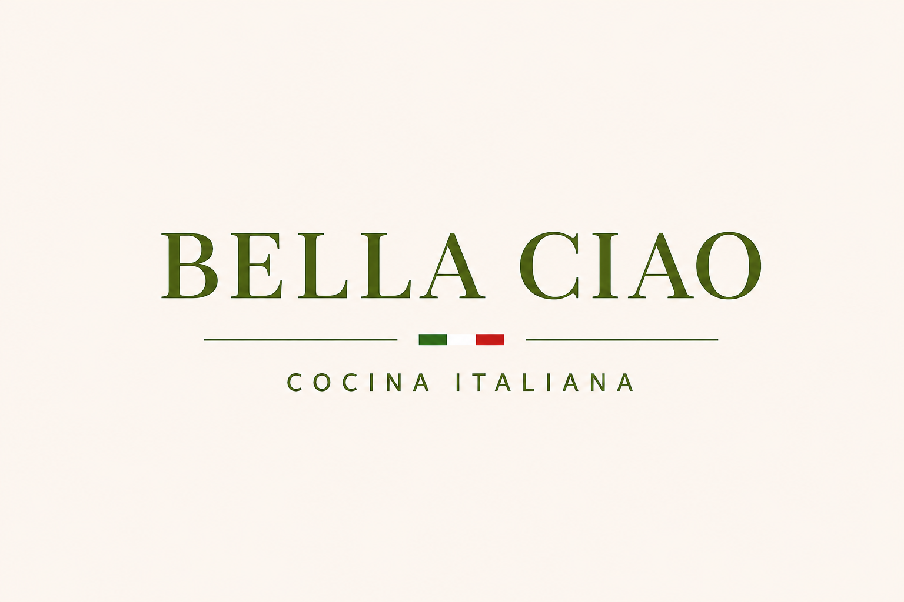

# Bella CIAO - Cocina Italiana

  

Plataforma web integral para la digitalización operativa y comercial de un restaurante bajo el concepto italiano. El sistema está diseñado para gestionar un flujo concurrente donde el valor central del negocio es la venta de pastas y pizzas personalizables (con masa, salsas y toppings configurables por el cliente). La plataforma centraliza la experiencia del usuario y la operación interna en un único entorno sincronizado.
