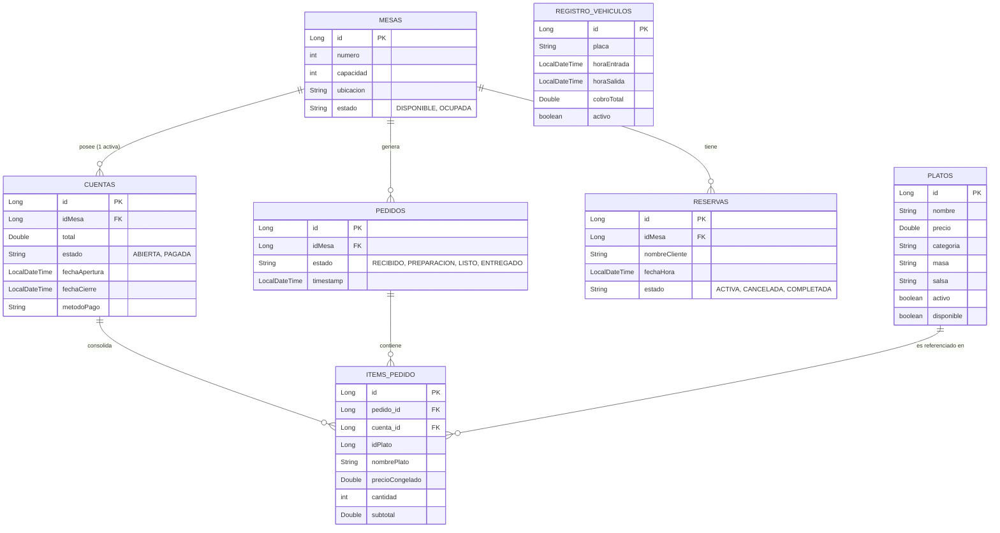
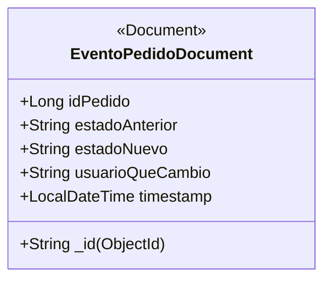

# Bella CIAO - Cocina Italiana

<p align="center">
  
</p>

Plataforma web integral para la digitalización operativa y comercial de un restaurante bajo el concepto italiano. El sistema está diseñado para gestionar un flujo concurrente donde el valor central del negocio es la venta de pastas y pizzas personalizables (con masa, salsas y toppings configurables por el cliente). La plataforma centraliza la experiencia del usuario y la operación interna en un único entorno sincronizado.

## Índice
1. [Arquitectura y Base de Datos (Persistencia Híbrida)](#arquitectura-y-base-de-datos-persistencia-híbrida)
2. [Modelo Entidad-Relación Relacional (PostgreSQL)](#modelo-entidad-relación-relacional-postgresql)
3. [Modelo de Documentos NoSQL (MongoDB)](#modelo-de-documentos-nosql-mongodb)
4. [Matriz de Roles y Permisos](#matriz-de-roles-y-permisos)
5. [Diagramas Estructurales (Clases y Componentes)](#diagramas-estructurales)

---

## Arquitectura y Base de Datos (Persistencia Híbrida)

El sistema implementa una **Persistencia Híbrida (Polyglot Persistence)**, dividiendo la carga de datos de manera estratégica entre una base de datos relacional orientada a transacciones y una base de datos documental rápida.

- **PostgreSQL (JPA/Hibernate):** Utilizada como núcleo transaccional. Almacena Reservas, Platos, Pedidos, Mesas, Cuentas y Vehículos. Se seleccionó por sus estrictas garantías ACID (Atomicidad, Consistencia, Aislamiento y Durabilidad), que son mandatorias para evitar inconsistencias contables, sobreventa de mesas o cruces en los pagos.
- **MongoDB:** Utilizada como base de datos documental aislada para el módulo de **Auditoría y Eventos de Pedidos** (`eventos_pedido`). Este dominio requiere almacenar miles de transiciones de estado por hora. Al ser una base de datos NoSQL, permite escribir estos "logs" asincrónicamente con máxima velocidad sin colapsar ni bloquear las tablas relacionales de la base de datos principal.

---

## Modelo Entidad-Relación Relacional (PostgreSQL)


```mermaid
erDiagram
    MESAS ||--o{ CUENTAS : "posee (1 activa)"
    MESAS ||--o{ PEDIDOS : "genera"
    MESAS ||--o{ RESERVAS : "tiene"
    
    CUENTAS ||--o{ ITEMS_PEDIDO : "consolida"
    PEDIDOS ||--o{ ITEMS_PEDIDO : "contiene"
    PLATOS ||--o{ ITEMS_PEDIDO : "es referenciado en"
    
    MESAS {
        Long id PK
        int numero
        int capacidad
        String ubicacion
        String estado "DISPONIBLE, OCUPADA"
    }

    PLATOS {
        Long id PK
        String nombre
        Double precio
        String categoria
        String masa
        String salsa
        boolean activo
        boolean disponible
    }

    PEDIDOS {
        Long id PK
        Long idMesa FK
        String estado "RECIBIDO, PREPARACION, LISTO, ENTREGADO"
        LocalDateTime timestamp
    }

    CUENTAS {
        Long id PK
        Long idMesa FK
        Double total
        String estado "ABIERTA, PAGADA"
        LocalDateTime fechaApertura
        LocalDateTime fechaCierre
        String metodoPago
    }

    ITEMS_PEDIDO {
        Long id PK
        Long pedido_id FK
        Long cuenta_id FK
        Long idPlato
        String nombrePlato
        Double precioCongelado
        int cantidad
        Double subtotal
    }

    RESERVAS {
        Long id PK
        Long idMesa FK
        String nombreCliente
        LocalDateTime fechaHora
        String estado "ACTIVA, CANCELADA, COMPLETADA"
    }

    REGISTRO_VEHICULOS {
        Long id PK
        String placa
        LocalDateTime horaEntrada
        LocalDateTime horaSalida
        Double cobroTotal
        boolean activo
    }
```

### Explicación del Modelo Relacional
El modelo anterior refleja el núcleo transaccional del restaurante basado en tablas fuertemente tipadas y llaves foráneas (`FK`):
- **MESAS (Eje Central):** Es la entidad sobre la cual gravita el servicio físico. Una mesa puede tener una sola **CUENTA** activa al mismo tiempo, generar múltiples **PEDIDOS** durante su uso, y recibir múltiples **RESERVAS** a lo largo del tiempo (relaciones 1:N).
- **PEDIDOS y CUENTAS:** Actúan como agrupadores de la entidad **ITEMS_PEDIDO**. Un pedido contiene los ítems que van hacia la cocina para preparación, mientras que la cuenta consolida todos esos ítems para la facturación final.
- **PLATOS (Catálogo):** Es el menú base. No se modifica directamente en los pedidos; en su lugar, se extraen sus datos (nombre y precio congelado en el tiempo) hacia el **ITEM_PEDIDO** para evitar alteraciones contables si un plato cambia de precio en el futuro.
- **REGISTRO_VEHICULOS:** Administra el ciclo de vida del parqueadero bajo reglas ACID (para evitar que un carro salga sin que su pago se refleje correctamente).

---

## Modelo de Documentos NoSQL (MongoDB)

De acuerdo a la naturaleza no relacional, la trazabilidad de los pedidos (logs) se maneja como una colección de eventos independientes (`Document Model`).


```mermaid
classDiagram
    class EventoPedidoDocument {
        <<Document>>
        +String _id (ObjectId)
        +Long idPedido
        +String estadoAnterior
        +String estadoNuevo
        +String usuarioQueCambio
        +LocalDateTime timestamp
    }
```

### Explicación del Modelo Documental
Este diagrama representa la estructura física lógica en MongoDB.
- **Auditoría Desacoplada (Self-contained):** A diferencia del modelo SQL, el `EventoPedidoDocument` no tiene una llave foránea restrictiva (`FK`) hacia la base de datos SQL. Solo guarda la referencia `idPedido` como texto/entero.
- **Alta Rotación:** Al no tener dependencias transaccionales cruzadas (Joins), MongoDB puede insertar miles de cambios de estado ("RECIBIDO -> EN PREPARACIÓN -> LISTO") por minuto sin causar un "cuello de botella" en PostgreSQL.
- **Identificador BSON:** Utiliza internamente un `_id` autogenerado por MongoDB optimizado para alta concurrencia, en vez de obligar al motor relacional a secuenciar logs.

---

## Matriz de Roles y Permisos

Para asegurar la correcta asignación de responsabilidades de acuerdo a la logística operativa del restaurante, el sistema define los siguientes perfiles de acceso:

| Funcionalidad / Caso de Uso | Administrador 👔 | Mesero 📝 | Cocinero 👨‍🍳 | Cliente (App) 📱 |
| :--- | :---: | :---: | :---: | :---: |
| **Crear y eliminar platos** | ✅ SÍ | ❌ NO | ❌ NO | ❌ NO |
| **Ver el menú (Catálogo)** | ✅ SÍ | ✅ SÍ | ✅ SÍ | ✅ SÍ |
| **Tomar Pedidos (Apertura)**| ✅ SÍ | ✅ SÍ | ❌ NO | ❌ NO |
| **Cambiar estado de pedido (A "En Preparación" / "Listo")** | ❌ NO | ❌ NO | ✅ SÍ | ❌ NO |
| **Cambiar estado de pedido (A "Entregado")** | ✅ SÍ | ✅ SÍ | ❌ NO | ❌ NO |
| **Marcar plato como agotado**| ✅ SÍ | ❌ NO | ✅ SÍ | ❌ NO |
| **Generar cobro y Cuentas** | ✅ SÍ | ✅ SÍ | ❌ NO | ❌ NO |
| **Crear Reservas** | ✅ SÍ | ✅ SÍ | ❌ NO | ✅ SÍ (Solo suyas) |
| **Cancelar/Modificar Reservas**| ✅ SÍ | ✅ SÍ | ❌ NO | ✅ SÍ (Solo suyas) |
| **Registrar Vehículos** | ✅ SÍ | ❌ NO | ❌ NO | ❌ NO |
| **Ver Reportes Financieros** | ✅ SÍ | ❌ NO | ❌ NO | ❌ NO |

---

## Diagramas Estructurales

Los siguientes diagramas detallan la arquitectura de software bajo la cual fue construido el código fuente de los componentes y clases del sistema.

### Diagrama de Clases
Muestra las clases del sistema, sus atributos y sus métodos de servicio:
<p align="center">
  
</p>

### Diagrama de Componentes (General y Específico)
Describe los bloques principales del sistema y las interacciones entre Controladores, Servicios, Mappers y Repositorios.

<p align="center">
  
</p>

<p align="center">
  
</p>

---

## Dockerización (Entorno Local)

Para levantar el ecosistema completo en contenedores (API, PostgreSQL y MongoDB), asegúrese de tener **Docker Desktop** instalado.

1. **Configurar el entorno:**
   Cree un archivo `.env` en la raíz del proyecto basado en `.env.example`.
2. **Levantar el stack:**
   ```bash
   docker compose up --build -d
   ```

### Variables de Entorno Requeridas
- `SERVER_PORT`: Puerto donde corre la API.
- `DB_HOST`, `DB_PORT`, `DB_NAME`, `DB_USER`, `DB_PASSWORD`: Credenciales para PostgreSQL.
- `MONGO_HOST`, `MONGO_PORT`, `MONGO_DB`: Credenciales para MongoDB.
- `JWT_SECRET`: Llave secreta en Base64 para firmar los tokens JWT.

### Link a Docker Hub
- **Imagen publicada:** [Ver en Docker Hub](#)

### Evidencias Docker

---

## Integración y Despliegue Continuo (CI/CD en Azure)

### Entornos y Políticas de Despliegue
- **QA:** Se actualiza automáticamente mediante push a las ramas `main` o `develop`.
- **PROD:** Requiere un tag de versión (`v*.*.*`) y aprobación manual desde GitHub para ejecutarse.

### Enlaces a la API desplegada
- 🧪 **API en QA:** [Swagger UI QA](#)
- 🚀 **API en PROD:** [Swagger UI PROD](#)

### Secrets configurados en GitHub
- `DOCKERHUB_USERNAME`, `DOCKERHUB_TOKEN`
- `AZURE_CREDENTIALS`
- `AZURE_WEBAPP_NAME_QA`, `AZURE_WEBAPP_NAME_PROD`
- `JWT_SECRET_QA`, `JWT_SECRET_PROD`
- `DB_PASSWORD_QA`, `DB_PASSWORD_PROD`

### Diagrama de Despliegue

### Evidencias CI/CD


